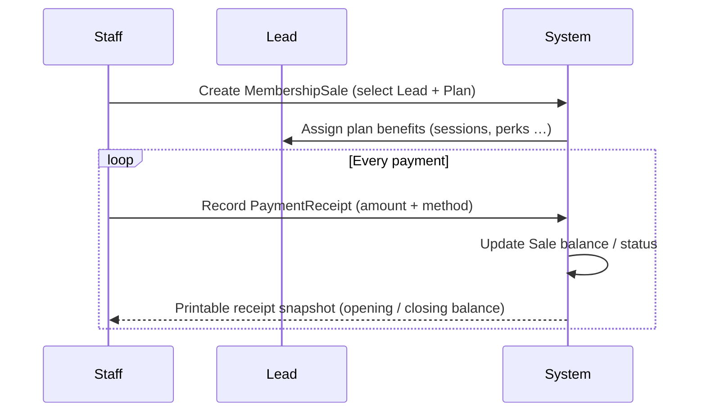
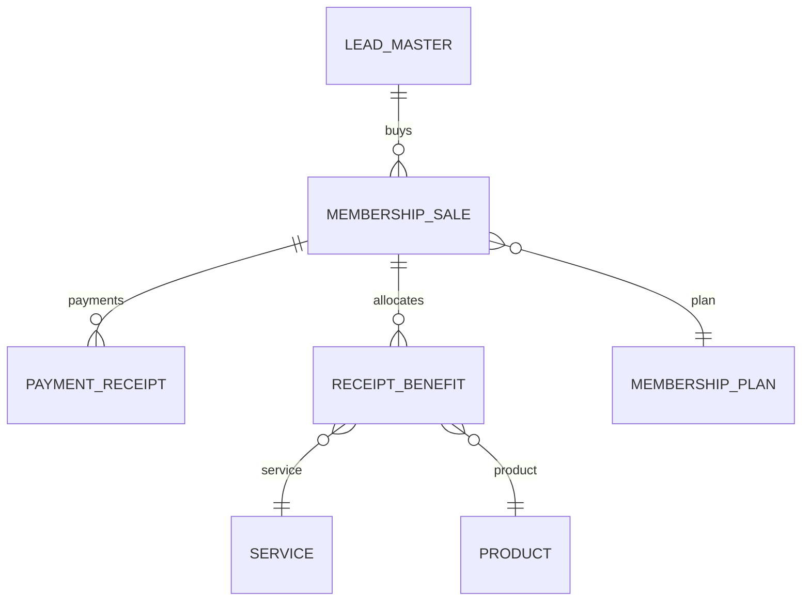

# Gym-CRM Membership & Receipt Module – Developer Guide

Welcome! This document gives you a bird’s-eye view of how membership sales, receipts, and benefits are modelled in our Django codebase.

---

## 1. High-Level Flow

---

## 2. Data Model Overview

| Model | Purpose | Key Fields |
|-------|---------|-----------|
| **MembershipPlan** | Catalog of plans (Premium, Student…) and included benefits | `plan_type`, `duration`, `price`, `pt_sessions`, `perks` |
| **MembershipSale** | One contract: a Lead buys a Plan | `lead`, `plan`, `decided_amount`, computed `balance` & `total_paid` |
| **PaymentReceipt** | One cash-in event / printable receipt | `sale`, `amount`, snapshot `opening_balance`, `closing_balance`, `method` |
| **ReceiptBenefit** | Tracks each service/product granted by the sale | `sale`, `service` *or* `product`, `quantity` |
| **Service** | Intangible benefit (PT session, diet consult …) | `type`, `sessions_count`, `subscription_type` |
| **Product** | Tangible perk (duffle bag, T-shirt …) | `sku`, `price` |

---

## 3. Lifecycle in Bullet Points

1. **Plan setup (once)**  
   • Admin creates `MembershipPlan` entries with duration, price, and included benefits.

2. **Sale creation (once per member per plan)**  
   • Staff selects a lead and a plan → creates `MembershipSale`.  
   • System auto-creates `ReceiptBenefit` rows equal to plan benefits.

3. **Payment processing (zero-to-many times)**  
   • Every time money is received, Staff records a `PaymentReceipt` linked to the sale.  
   • The model captures `opening_balance` and calculates `closing_balance`.  
   • Sale’s `total_paid` & `balance` properties reflect up-to-date figures.

4. **Usage tracking**  
   • As the member consumes PT sessions or receives products, update / decrement the relevant `ReceiptBenefit` rows (future enhancement).

---

## 4. Why This Design Rocks

- **Immutable Audit Trail** – `PaymentReceipt` snapshots never change; perfect for re-prints & audits.  
- **Single Source of Truth** – Only `MembershipSale` knows the agreed amount; no duplication.  
- **Scalable Benefits** – Benefits come from generic `Service`/`Product` models; new offerings need no schema change.  
- **Partial Payments** – Unlimited receipts per sale; balance auto-maintained.  
- **Reporting Ready** – Easy joins let you answer: “Who still owes?”, “How many sessions remain?”, etc.

---

## 5. Next Steps for New Devs

1. Browse the Django models in `accounting/models.py` and `logistics/models.py`.  
2. Check the signal in `accounting/signals.py` that auto-assigns benefits on `MembershipSale` save.  
3. Look at admin classes to see inline editing of payments and benefits.  
4. Run `pytest` – tests cover balance calculation and receipt snapshots.

Happy coding!
