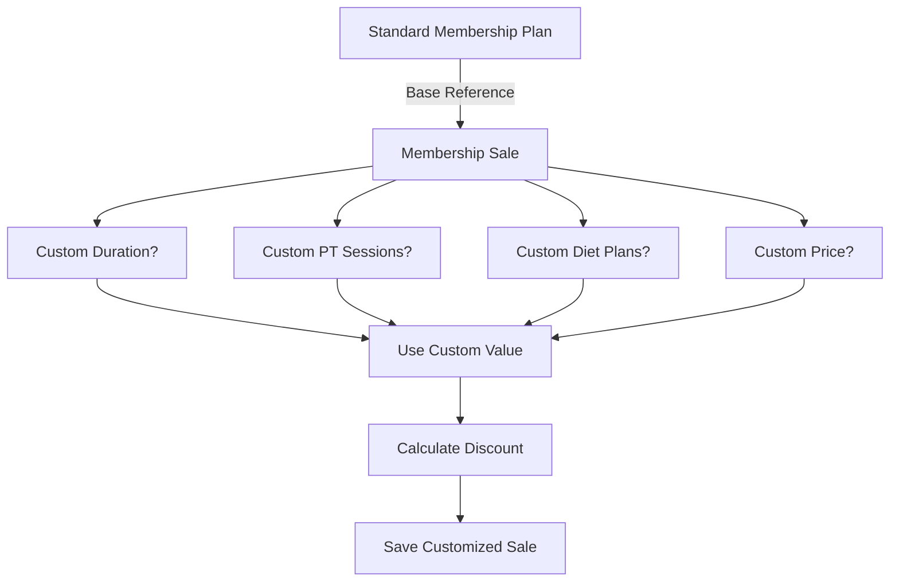
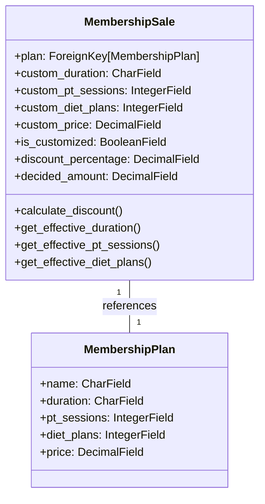

# Membership Sale Customization Strategy

## Overview
This document outlines the strategy for handling customizable membership sales, allowing deviations from standard plans while maintaining data integrity and reporting capabilities.

## Core Concept



## Data Model

### MembershipSale Model Additions



## Customization Flow

1. **Initial Plan Selection**
   - User selects a standard membership plan
   - Standard plan details are displayed

2. **Customization Toggle**
   - User can enable customization
   - Customization fields become editable
   - Standard values are pre-filled but can be overridden

3. **Price Calculation**
   - System calculates standard price for selected duration
   - Custom price can be set below standard price
   - Discount percentage is auto-calculated

## Business Rules

1. **Default Values**
   - If no custom values are set, use plan values
   - `is_customized` is `False` by default

2. **Validation Rules**
   - Custom price cannot exceed standard price
   - Custom PT sessions/diet plans cannot be negative
   - Duration must be one of the allowed values

3. **Discount Calculation**
   ```
   standard_price = plan.price * (custom_duration_months / plan_duration_months)
   discount_percentage = ((standard_price - custom_price) / standard_price) * 100
   ```

## Reporting Capabilities

### Key Metrics
- Number of customized vs standard sales
- Average discount given
- Most frequently customized plans
- Revenue impact of customizations

### Sample Reports
1. **Discount Analysis**
   ```
   SELECT 
       plan.name,
       AVG(discount_percentage) as avg_discount,
       COUNT(*) as total_sales
   FROM accounting_membershipsale
   WHERE is_customized = True
   GROUP BY plan.name
   ORDER BY avg_discount DESC;
   ```

2. **Customization Frequency**
   - Which features are most often customized
   - Average reduction in PT sessions/diet plans

## Implementation Notes

### Model Methods
```python
def get_effective_duration(self):
    """Return custom duration if set, otherwise plan duration."""
    return self.custom_duration if self.is_customized else self.plan.duration

def calculate_discount(self):
    """Calculate discount percentage based on standard vs custom price."""
    if not self.is_customized:
        return Decimal('0')
    standard_price = self.get_standard_price()
    if standard_price == 0:
        return Decimal('0')
    return ((standard_price - self.custom_price) / standard_price) * 100
```

### Form Handling
- Use JavaScript to show/hide customization fields
- Auto-calculate and display discount in real-time
- Validate custom values against business rules

## Future Considerations
1. **Tiered Discounts**
   - Automatic discounts for specific membership types
   - Bulk purchase discounts

2. **Temporary Promotions**
   - Time-bound custom pricing
   - Special event discounts

3. **Approval Workflow**
   - Manager approval for large discounts
   - Audit trail for customizations
