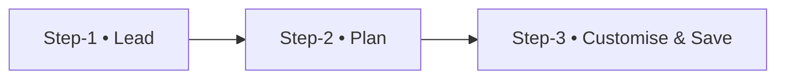

# Membership Sale – UI / UX Blueprint

> **Goal:** Let an owner complete a sale (pick lead → pick plan → tweak → save) in < 60 s with zero page navigation.

---

## 1 · User Journey (Wizard Flow)


* All three steps live **inside one large Bootstrap modal** (`.modal-lg`).
* The modal is injected by htmx (GET `/sales/new/`).
* Hidden parent `<form>` spans the whole wizard – preserves data & CSRF.

---

## 2 · Step Details

| Step | Component | Key UX Decisions |
|------|-----------|------------------|
| 1 • Lead | `Select2` (AJAX search) + “➕ Add New” button | Fuzzy-search existing leads; small modal for inline creation (re-uses Lead form) |
| 2 • Plan | `Select2` (AJAX) + plan badge preview | Instant context → shows duration, price, PT sessions, diet plans |
| 3 • Customise | Bootstrap grid form | Toggle “Customise?” switch → enables overrides.
Display live discount hint below price.
Start date uses date-picker (default **today**).|

---

## 3 · Wireframe

```mermaid
graph TB
    subgraph Modal (.modal-lg)
        direction LR
        stepper[Wizard Tabs]
        cardLead[Lead Card]\n(id_lead Select2 + Add Lead)
        cardPlan[Plan Card]\n(id_plan Select2 + Add Plan) 
        cardEdit[Customise Card]\n(Duration▼, Price ₹, PT, Diet, Start Date)
        footer[Sticky Footer]\n(Back · Next · Save)
    end
    stepper --> cardLead --> cardPlan --> cardEdit --> footer
```

---

## 4 · Key Components & Code Snippets

### Select2 with AJAX
```javascript
$('#id_lead').select2({
  ajax: {
    url: '/leads/search',
    dataType: 'json',
    delay: 250,
    data: params => ({ q: params.term })
  },
  dropdownParent: $('#membershipSaleModal')
});
```

### Customisation Toggle
```html
<div class="custom-control custom-switch">
  <input type="checkbox" class="custom-control-input" id="id_is_customised">
  <label class="custom-control-label" for="id_is_customised">Customise plan?</label>
</div>
```
JS enables/disables override fields and updates discount text.

### Price / Discount Hint
```html
<div class="input-group">
  <div class="input-group-prepend"><span class="input-group-text">₹</span></div>
  <input ... id="id_custom_price">
</div>
<small class="text-muted" id="priceHint">Standard: ₹12 000 · Discount: 0 %</small>
```

---

## 5 · Accessibility & Responsiveness
* **Focus-trap** inside modal, arrow-key nav between wizard steps.
* Mobile: cards stack vertically, footer buttons full-width.
* Semantic labels + `aria-` attributes for all custom controls.

---

## 6 · Validation & Error Handling
* Client: inline Bootstrap feedback (negative numbers, empty required fields).
* Server: Django form errors returned via htmx swap; error alert shown at top of current step.
* No data persisted until final **Save** (atomic transaction).

---

## 7 · Why This Design?
* **Context-preserving** – never leaves the modal.
* **Inline creation** – no tab-sprawl.
* **Progressive disclosure** – custom fields hidden by default.
* **Instant feedback** – live discount %, badges, tooltips.
* **Bootstrap 4.6 & Select2** – consistent with existing stack, minimum new dependencies.
